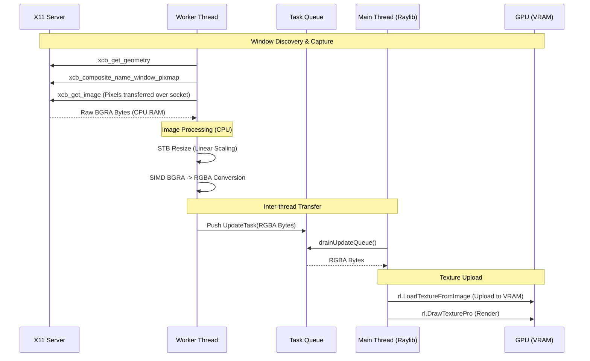
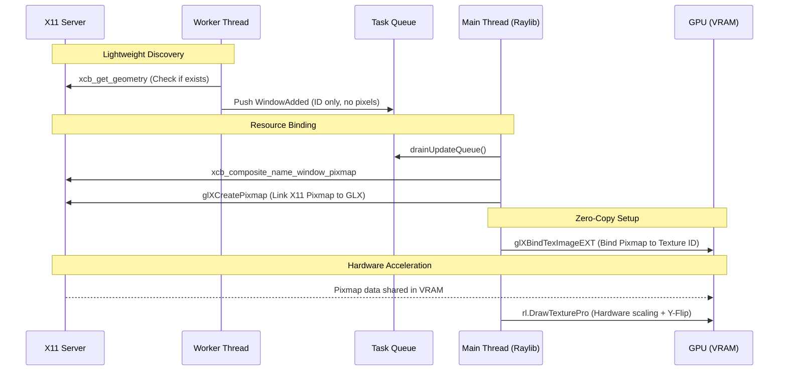

# FastTab Screen Capture Paths

This document diagrams the two different ways FastTab captures window content: the optimized **GLX Path** (zero-copy) and the fallback **XCB Path** (CPU-bound).

## 1. Non-GLX Path (XCB Fallback)

This path is used when GLX is unavailable (e.g., software rendering, some VMs, or when a window is minimized). It involves significant CPU overhead and multiple copies between RAM and VRAM.

**Key Characteristics:**
- **CPU Heavy:** Resizing and color conversion happen on the CPU.
- **High Latency:** Pixels travel from X Server -> Worker RAM -> Main Thread RAM -> GPU VRAM.
- **Memory Pressure:** Stores full RGBA pixel buffers in the task queue.

---

## 2. GLX Path (Zero-Copy)

This is the primary optimized path. It binds X11 pixmaps directly to OpenGL textures using the `GLX_EXT_texture_from_pixmap` extension.

**Key Characteristics:**
- **Zero-Copy:** Pixel data never touches CPU RAM. It stays in GPU memory.
- **Instant Updates:** Uses the X11 `Damage` extension to rebind only when the window content actually changes.
- **Hardware Scaled:** The GPU handles resizing the full-resolution window pixmap to the thumbnail size during the render pass.
- **Y-Flipped:** Since GL coordinates are bottom-up and X11 is top-down, the UI layer flips the source rectangle.

## Summary Comparison

| Feature | XCB Fallback | GLX (Optimized) |
| :--- | :--- | :--- |
| **Primary Mover** | CPU | GPU |
| **Data Location** | RAM | VRAM |
| **Resizing** | CPU (stb_image_resize) | GPU (Hardware Sampler) |
| **Color Conv** | CPU (SIMD) | Hardware (Automatic) |
| **Latency** | High (ms) | Near-Zero (µs) |
| **Memory Usage** | High (Pixel Buffers) | Minimal (Handle pointers) |
